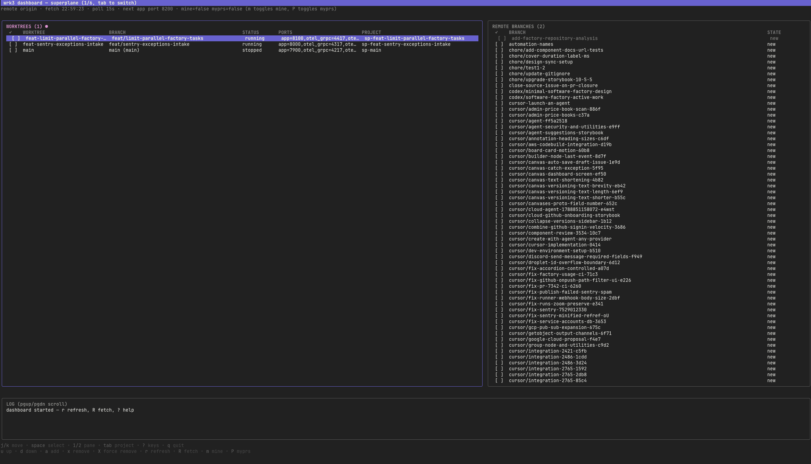

# wrk3

[](go.mod)
[](LICENSE)

Run **multiple branches of the same repo in parallel** as git worktrees, each
isolated with its own ports and container project — from any directory.

`wrk3` was built for stacks where one checkout = one full environment
(e.g. a `docker compose` dev stack): point it at a repo, `add` two branches,
`up`, and get two running copies on distinct ports and distinct compose
projects.



## Dashboard (start here)

```bash
wrk3 dashboard   # or: wrk3 db
```

The dashboard is the fastest way to drive `wrk3` — one TUI over the
current repo plus every registered project (`tab` switches). It polls
worktree state and remote branches (default every 15s, `--poll 0`
disables), and runs the same operations as the CLI without leaving the
screen.

Layout (lazygit-style 5-box grid, two columns on terminals ≥80 cols,
stacked otherwise) with `[n]` numbers and `x of y` counts on every list:

- **[1]-Worktrees (top-left)** — slim `SLUG` + health `STATUS` only
  (`running`, `stopped`, `setting up`, `stopping`, `failed`,
  `stale`/`?` when the directory is missing, plus the health summary).
  Full branch/ports/URL details live in DETAILS (`o` opens the URL in a
  browser, `O` copies it to the clipboard).
- **[2]-Branches (middle-left)** — queueable refs with `STATE`
  (`new` queueable, `orphan` = on-disk worktree missing from state and
  adoptable, `registered`/`checked out` not queueable). Your branches
  sort first (open involving-me PRs when the forge answers, else
  tip-matching `--mine` branches), then the rest newest-first by tip
  committer date.
- **Projects (bottom-left)** — project switcher (`tab` switches) plus
  `remote`/`fetch`/`poll`/`proxy` status.
- **Details (top-right, preview)** — selected/cursor worktree
  (`branch/slug/status/health/ports/url/path/project`), follows the worktree
  cursor and multi-select.
- **[3]-Logs (bottom-right, large, focusable)** — two tabs: `console` (command output from `u`/`d`/`l`/`x`, auto-shown when output lands) and `dashboard` (event lines). Focus with arrows/`1`/`2`/`3`, toggle with `t`, scroll with `j/k`/`↑`/`↓` (plus `pgup`/`pgdn`/`home`/`end` from any pane).

| Keys | Action |
| ---- | ------ |
| `j/k` or `↑/↓` | move cursor (scrolls the active log tab when LOG is focused) |
| `t` | toggle log tabs (`console` command output / `dashboard` events) |
| `space` | select (multi-select; `u`/`d`/`x` fall back to the cursor row) |
| `1`/`2`/`3` or `←`/`→` | switch pane (worktrees/branches/log) |
| `tab` | switch project |
| `u` / `d` | `up` / `down` selected worktrees (rows flip to `setting up`/`stopping` immediately) |
| `a` | `add` queued branches (creates the checkout, or adopts the on-disk worktree) |
| `o` | open the cursor worktree `URL` in a browser (full URL is logged too) |
| `O` | copy the cursor worktree `URL` to the OS clipboard (`pbcopy` on macOS, `wl-copy`/`xclip`/`xsel` on Linux, `clip` on Windows; the URL is logged too) |
| `e` | edit the cursor worktree `.env` in `$VISUAL`/`$EDITOR` (TUI suspends fullscreen, resumes on quit) |
| `x` / `X` | `remove` / `remove --force` selected worktrees (confirm dialog, never touches main) |
| `r` / `R` | refresh state / fetch remote |
| `m` / `P` | toggle `mine` / `myprs` branch filters |
| `?` | `Menu` popup with every action (`j/k` move, `enter` runs, `esc` closes) |
| `q` | quit |

Filters and targets: `--remote`/`--mine`/`--author`/`--myprs` seed the
branch list (`m`/`P` toggle live), `--project <name>` starts from a
registered project, `--poll <dur>` tunes polling. The CLI keeps working
alongside — `wrk3 add` in another terminal shows up on the next poll or
`r`. Full key/flag reference: [docs/USAGE.md](docs/USAGE.md#dashboard-tui).

## Features

- **Interactive dashboard** — `wrk3 dashboard` polls worktrees, remote
  branches, and ports across the current repo and registered projects
  (`tab` switches), with `up`/`down`/`add`/`remove` from the keyboard
  (`x` removes, `X` force-removes like `remove --force`).
  The CLI keeps working alongside it.

- **Parallel worktrees** — `git worktree add/remove/list` behind a `Source`
  interface (`git` ships; the shape reserves future backends).
- **Isolated runners** — `docker compose` or `podman compose` with
  `-p <prefix>-<slug>` per worktree behind a `Runner` interface
  (`docker` and `podman` ship; `portainer`/`nomad` stubs
  return `not implemented`).
- **Range ports with gap reuse** — per-service `ranges` scanned from `base`
  upward by 1 (lowest free wins, OS-occupied skipped, exhaustion names the
  service), ensured in each worktree's `.env` (managed `<NAME>_PORT` keys
  overwritten to the allocation; your secrets and other lines stay, and new
  worktrees inherit non-managed keys from the repo root); `status` reads
  them back from the state file (`?`/`stale` when the directory is missing).
- **Compose-style config** — wrk3 finds `wrk3.yaml`/`wrk3.yml`
  walking up from cwd (`-f/--file` to override), so it works from any
  subdirectory. `add` auto-registers the repo for `project ls` /
  `ls --project`.
- **Shell completion** — tab-completion for subcommands, flags, and
  dynamic branch/worktree/project completion for `add`/`up`/`down`/`reload`/`pull`/`logs`/`exec`/`env`/`remove`/`checkout`/`proxy open`/`ls --project`
  (prefix-filtered) loads with the `shell-init` snippet below — no extra
  setup (`wrk3 completion <bash|zsh|fish|powershell>` static files remain
  for setups that prefer them).
- **Worktree switching** — `wrk3 checkout <branch|slug>` cds to the
  worktree (via a `wrk3 shell-init` wrapper eval'd once in your rc file;
  prints the path without it, so `cd "$(wrk3 checkout x)"` always works).
- **Single static binary** — Go, no runtime deps besides `git` and a
  container engine (`docker` for the `docker` runner, `podman` for the
  `podman` runner).
 - **Interactive dashboard** — `wrk3 dashboard` polls worktrees, remote
  branches, and ports across the current repo and registered projects
  (`tab` switches), with `up`/`down`/`add`/`remove` from the keyboard
   (`x` removes, `X` force-removes like `remove --force`).
  The CLI keeps working alongside it.

## Install

No Go toolchain needed — `git` and a container engine at runtime
(`docker` for the `docker` runner, `podman` for the `podman` runner).
Full details:
[docs/INSTALL.md](docs/INSTALL.md).

```bash
# Option 1 — release assets (linux/darwin/windows, checksums verified, no sudo: installs to ~/.local/bin)
curl -fsSL https://raw.githubusercontent.com/mytmlt/wrk3/main/scripts/install.sh | bash

# Option 2 — download the asset manually from GitHub releases
# (see docs/INSTALL.md for the verify + install steps)

# Option 3 — from source (developers only, requires Go ≥ 1.26)
git clone https://github.com/mytmlt/wrk3.git && cd wrk3
make install            # installs to ~/.local/bin, no sudo (ensure it is on PATH)
# machine-wide instead: sudo make install PREFIX=/usr/local
wrk3 version
```

`wrk3` notifies you when a new release exists
(`WRK3_NO_UPDATE_CHECK=1` to silence) and updates in place:

```bash
wrk3 update --check
wrk3 update
```

Shell integration (needed so `wrk3 checkout` cds your shell) also loads
tab-completion — one line and TAB just works:

```bash
eval "$(wrk3 shell-init bash)"   # ~/.bashrc (zsh/fish/powershell too; zsh: after compinit)
```

Static completions instead: `make completion` then source
`completions/wrk3.<bash|zsh|fish|powershell>`.

## Quickstart (5 minutes)

```bash
# 1. Describe your repo (see wrk3.yaml.example + docs/CONFIGURATION.md)
cp wrk3.yaml.example wrk3.yaml  # local use; keep gitignored in app repos
$EDITOR wrk3.yaml  # config lives in the repo root; commit only templates

# 2. Fetch remote branches, create two isolated worktrees (run inside the repo)
wrk3 fetch
wrk3 fetch --mine                    # only your branches (tip or last 100 branch-exclusive commits match git config user)
wrk3 fetch --author alice            # substring match on author/committer name/email (tip or history)
wrk3 fetch --myprs                   # branches with an open PR involving you (GitHub remotes only, via gh)
wrk3 add feature-a feature-b
# or pick interactively: wrk3 add
# or kick off something new (prompts to create from origin/<default>): wrk3 add feat/new-thing
# or bulk-create from a remote: wrk3 add --remote upstream --mine

# 3. Boot both stacks in parallel (setup entries, compose up, run entry)
wrk3 up

# 4. Inspect, tail, run commands (dashboard first, CLI alongside)
wrk3 dashboard                  # start here — worktrees + branches + up/down/reload/pull/add/remove
wrk3 reload                     # entry.reload commands (bare = all including main)
wrk3 pull feature-a             # git pull in one worktree (bare = all including main; --rebase/--ff-only)
wrk3 git-status                 # git status per worktree (bare = all including main; --short adds files)
wrk3 status
wrk3 ls --project myapp   # same worktrees from any dir (after add registers it)
wrk3 project ls           # all registered projects
wrk3 logs feature-a -f
wrk3 exec feature-a -- make test
wrk3 env feature-a   # open the worktree .env in $VISUAL/$EDITOR (--print to cat instead)
wrk3 checkout feature-a   # cd to the worktree (after eval "$(wrk3 shell-init bash)" in your rc file)

# 5. Tear down
wrk3 down
wrk3 remove --all
```

## Configuration

```yaml
project:
  worktreeBase: .worktrees        # relative => resolved against repo root (config dir)
source:
  type: git
  git: {remote: origin, fetchPrune: true}
runner:
  type: docker
  docker:
    composeFiles: [docker-compose.yml]
    projectPrefix: demo                 # optional; empty/missing => slug-only compose project
entry:
  setup: ["docker compose up --wait --build"]
  run: "docker compose logs -f"
  stop: "docker compose down"
  logs: "docker compose logs -f"
  reload: ["docker compose restart app"]
ports:
  base: {app: 8000}
  ranges:
    app: [8000, 8099]
```

Full field reference, port table, `.env` mapping, and multi-project patterns:
[docs/CONFIGURATION.md](docs/CONFIGURATION.md). Command reference:
[docs/USAGE.md](docs/USAGE.md).

Project goal: turn **any codebase** into a `wrk3.yaml` that runs the app
the way its developers run it locally — see [ROADMAP.md](ROADMAP.md)
for where the `docker` / `podman` / `portainer` / `nomad` / bare-machine runners stand.

## How it works

1. `wrk3 add <branch>` → `git worktree add <base>/<slug>` (tracking
   `<remote>/<branch>` when remote-only; prompts to create from
   `<remote>/<default>` — `--create`/`--no-create` — when the name matches
    nothing), copies `source.git.copy`
    includes (if any), assigns the
    next index (monotonic id) plus the lowest free range ports (gap reuse,
    OS-aware), ensures managed port keys in
    `.env` (allocation always wins; secrets and user keys stay), appends
   `{branch, slug, absPath, index, ports, composeProject, status}` to
   `<worktreeBase>/.wrk3-state.json` (absolute paths → cwd-independent).
   `add --remote <name> [--mine]` bulk-creates from a remote (default:
   `source.git.remote`, else `origin`), skipping already registered or
   checked-out branches.
2. `wrk3 up` → runs `entry.setup` commands (`sh -c`, `cwd=worktree`,
    `env=ports`), then `compose -p <prefix>-<slug> up` via the configured
    engine (`docker` or `podman`), then
    `entry.run` — in parallel across worktrees via errgroup with prefixed logs.
    Bare `up`/`down` apply to all worktrees including the implicit main
    checkout (repo root, reserved port index 0 — the `ports.base` allocation,
    managed `.env` section ensured on run);
    pass names to filter. With `shared` configured, `up` first ensures
    the shared project (`compose up -d --wait` on the shared scope, then
    per-slug `shared.setup` isolation hooks), starts only
    `shared.worktreeServices` (`--no-deps`), and `down` never touches
    shared (only `wrk3 shared down` stops it).
3. `wrk3 status` → reconciles the state file against `git worktree list`
    (on-disk worktrees missing from state are adopted, ports recovered
    from `.env` or freshly allocated), probes live runner status
    (`compose ps -q`, then label-based fallbacks so out-of-band
    compose up counts as `running`), syncs drift back to the
    state file, and prints
    `WORKTREE/BRANCH/STATUS/PORTS/COMPOSE_PROJECT` (plus `URL` when
    `proxy.enabled` → `http://<slug>.localhost:<port>` via the stdlib
    gateway; `up` auto-starts it, `wrk3 proxy status|open|hosts-sync`
    manage it). Every read (`status`/`ls`/`up`/`down`/dashboard) syncs
    the same way — live `running` always wins, `unknown` never persists.
    Optional `health.checks` add a display-only Docker-style suffix to
    running rows (`running (healthy)` / `running (degraded 1/2)` /
    `running (unhealthy)`; compose `healthcheck:` containers included).
    Details: [docs/USAGE.md](docs/USAGE.md).
4. `wrk3 remove` → `compose down -v` + `git worktree remove` + state cleanup.
     `remove` never touches main (explicit `remove <main-branch>` is refused;
     `remove --all` covers only managed worktrees).
5. `wrk3 log` → every operation above also appends to
    `<worktreeBase>/.wrk3-log.jsonl` (JSONL next to the state file):
    exact commands run, cwd, duration, state transitions, warnings/errors.
    The dashboard log pane stays brief; `wrk3 log [-n N] [--json]` shows
    the full persisted history.

## Development

```bash
go build ./... && go vet ./... && go test ./... -count=1
# or
make test
```

See [CONTRIBUTING.md](CONTRIBUTING.md) for contribution process and commit style, and
[docs/INSTALL.md](docs/INSTALL.md) / [docs/CONFIGURATION.md](docs/CONFIGURATION.md) /
[docs/USAGE.md](docs/USAGE.md) for setup and usage. [ROADMAP.md](ROADMAP.md)
tracks the any-codebase project goal and runner coverage. To add a new `Source` or
`Runner` backend, see [docs/PLUGINS.md](docs/PLUGINS.md). Agent onboarding
lives in [skills/](skills/) (`wrk3-setup`: compatibility triage → author +
validate `wrk3.yaml`) — behavior changes must update docs + skills +
changelog together (see `AGENTS.md`).

## License

[MIT](LICENSE) © 2026 Mijat Miletic.
